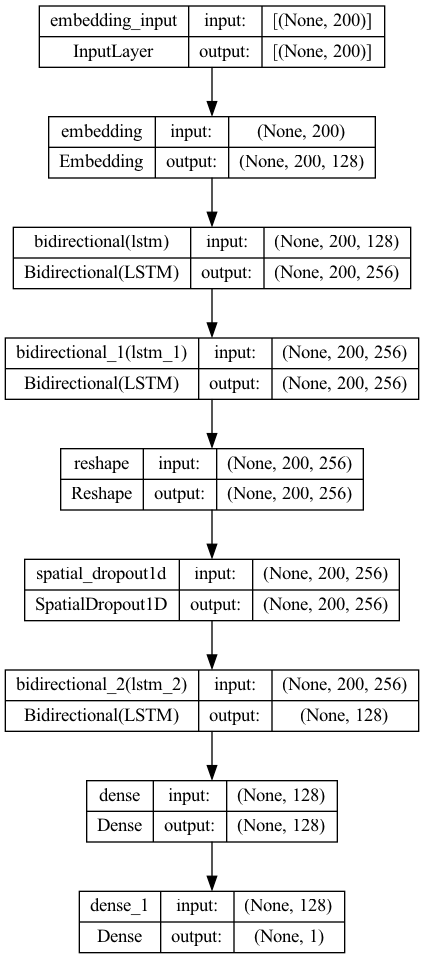

# fakenewsDetector_trainer

Train models for the detection of fake new through 3 artificial neural network architectures

# Version


# Release date


# License


# Programming language


# OS

  

# Requirements

```bash
pip install tensorflow pandas sklearn
```

```python
import pandas as pd
import tensorflow as tf
from sklearn.model_selection import train_test_split
from sklearn.preprocessing import LabelEncoder
from tensorflow import keras
from tensorflow.keras.preprocessing.text import Tokenizer
from tensorflow.keras.preprocessing.sequence import pad_sequences
from tensorflow.keras.models import Sequential
from tensorflow.keras.layers import Embedding, LSTM, Dense, Bidirectional, Dropout, SpatialDropout1D, Reshape
from tensorflow.keras.regularizers import l2
```

# How to run

```python
filename = 'training_database.csv'
data = load_data(filename)
X_train, X_test, y_train, y_test = preprocess_data(data)
X_train_seq, X_test_seq = tokenize_text(X_train, X_test)
model = build_simplemodel(max_words=10000, max_sequence_length=200)
loss, accuracy = train_and_evaluate_model(model, X_train_seq, y_train, X_test_seq, y_test)
```

# 'training_database.csv' file structure

It is made up of three columns separated by commas.

Samples:
```csv
Newsheadline, News, FakeOrReal
headline_1, news_1, fake
headline_2, news_2, fake
headline_3, news_3, real
headline_4, news_4, real
headline_5, news_5, fake
.
.
.
headline_n, news_n, fake 
```
The third column is a binary value, it can be [0,1], [fake,real] or [true,false]

# Function input parameters: train_and_evaluate_model

Definition:
```python
train_and_evaluate_model(model, X_train, y_train, X_test, y_test, epochs=5, batch_size=64, learning_rate=0.001, enable_gpu=False, verbose=True)
```

> Input arguments:
>
>> `model`: The Keras model to be trained and evaluated. It should be a model previously defined using the Keras library.
>>
>> `X_train`: The training data (features) to be used for training the model. It should be a NumPy array or a compatible data structure.
>>
>> `y_train`: The training labels corresponding to the training data. It should be a NumPy array or a compatible data structure.
>>
>> `X_test`: The test data (features) to be used for evaluating the model. It should be a NumPy array or a compatible data structure.
>>
>> `y_test`: The test labels corresponding to the test data. It should be a NumPy array or a compatible data structure.
>>
>> `epochs`: The number of epochs (complete iterations through the entire training dataset) to be used for training the model. It is set to 5 epochs by default.
>>
>> `batch_size`: The batch size to be used during training. It determines how many examples are processed at once before updating the model's weights. It is set to 64 by default.
>>
>> `learning_rate`: The learning rate that controls the rate at which the model's weights are adjusted during training. It is set to 0.001 by default.
>>
>> `enable_gpu`: A boolean flag that determines whether GPU (Graphics Processing Unit) training will be enabled if available. If True, training is performed on the GPU; otherwise, it's done on the CPU. It is set to False by default.
>>
>> `verbose`: A boolean flag that controls the verbosity during training and evaluation. If True, progress messages are displayed; if False, no messages are shown. It is set to True by default.

# Model architecture

function name: build_simplemodel


function name: build_robustmodel


function name: build_ultrarobustmodel



